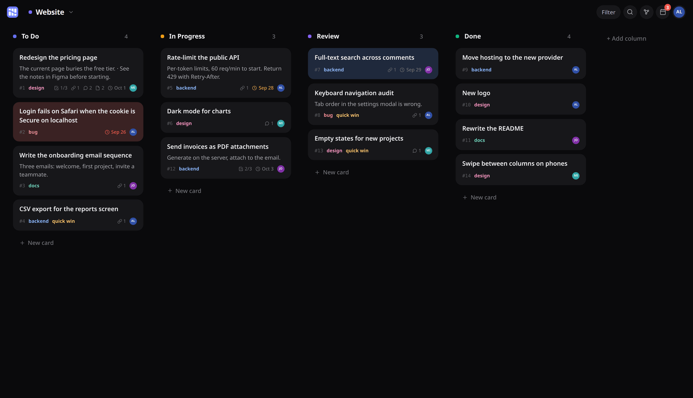
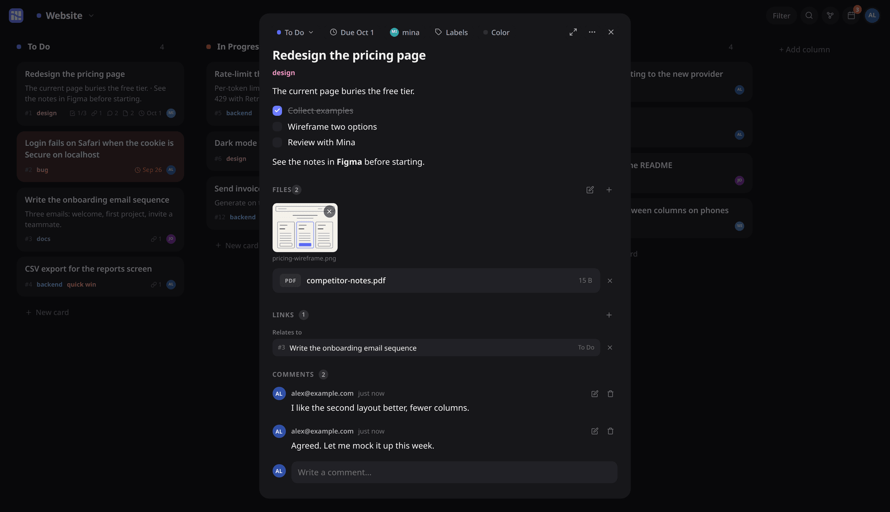
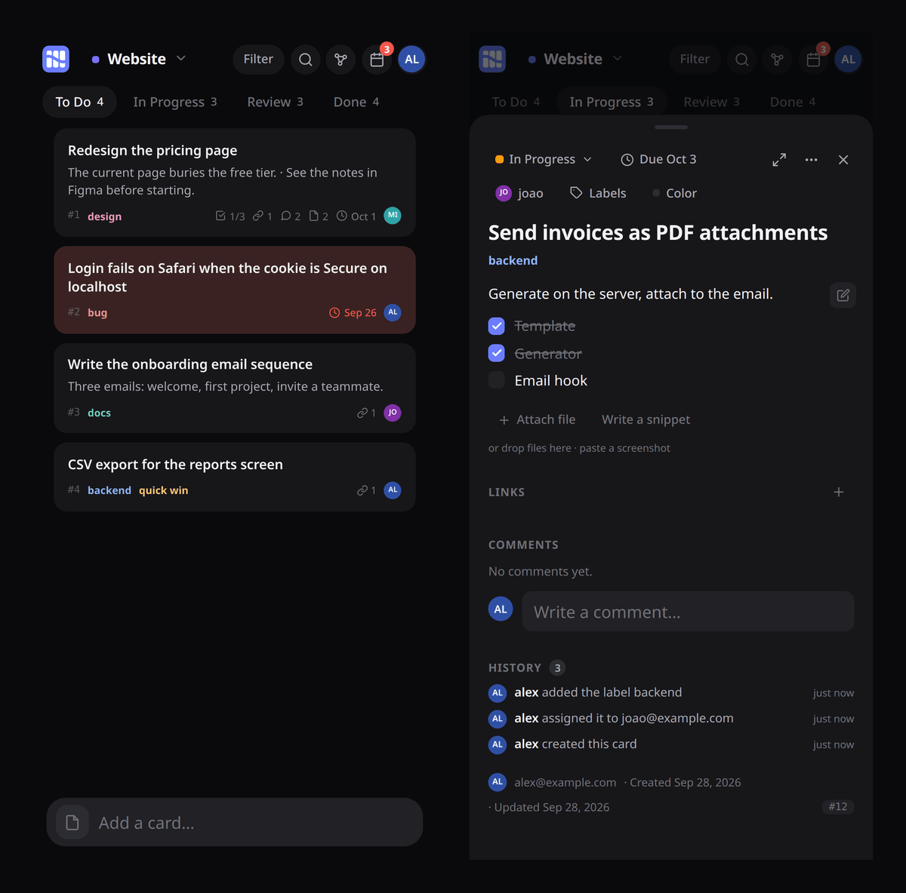

<div align="center">


# Kanagare

A small kanban board you host yourself.
</div>



I built this for myself and a few people I work with. It runs as one Node
process with one SQLite file, or for free on Cloudflare Workers.

What's in it:

- projects, columns and cards, with drag and drop (mouse and touch)
- markdown notes with checkboxes, comments, labels, due dates, assignees
- file attachments (drop them on a card or paste a screenshot)
- links between cards (`relates`, `blocks`, `parent`) and a graph view of them
- full-text search across cards, comments and files
- a "today" view of what's due across all projects
- card history and reusable card templates
- keyboard shortcuts (press `?`), dark and light themes, works on phones, installable as a PWA

There's no signup. An admin creates accounts from inside the app.

<table>
  <tr>
    <td width="62%"></td>
    <td></td>
  </tr>
</table>

## Running it

You need Node 22.18 or newer (24 recommended). It runs the TypeScript
directly, so there's no server build.

```bash
git clone https://github.com/shinjuku712/kanagare.git
cd kanagare
npm install
npm run build

NODE_ENV=development ADMIN_EMAIL=you@example.com ADMIN_PASSWORD=pick-something npm start
```

Open http://127.0.0.1:3463 and sign in. The admin is only created when the
database has no users yet, so those two variables do nothing after the first
start. Change the password from the app.

`NODE_ENV=development` is only for trying it over plain http. Without it the
session cookie is HTTPS-only, which is what you want in production: it
listens on localhost, and nginx or Caddy in front of it does the HTTPS.

## Configuration

Everything is an environment variable, and everything has a default. Copy
[.env.example](.env.example) to `.env` and start with
`node --env-file=.env server/index.ts`, or point systemd's `EnvironmentFile`
at it.

| Variable | Default | |
|---|---|---|
| `PORT` | `3463` | |
| `DB_PATH` | `kanagare.db` in the repo folder | |
| `UPLOADS_DIR` | `uploads/` in the repo folder | attachment files |
| `MAX_UPLOAD_BYTES` | `26214400` | 25 MB per file |
| `COOKIE_NAME` | `kanagare_session` | changing it signs everyone out |
| `NODE_ENV` | | anything but `development` makes the cookie HTTPS-only |
| `APP_NAME`, `APP_DESCRIPTION` | `Kanagare`, … | name of the installed app |
| `ADMIN_EMAIL`, `ADMIN_PASSWORD` | | first admin, first start only |

## More

- [docs/hosting.md](docs/hosting.md): running it on a server or on Cloudflare, backups, a lost admin password
- [docs/API.md](docs/API.md): the HTTP API (everything the UI does, you can do with curl)
- [CONTRIBUTING.md](CONTRIBUTING.md): how the code is laid out

## License

[MIT](LICENSE)
